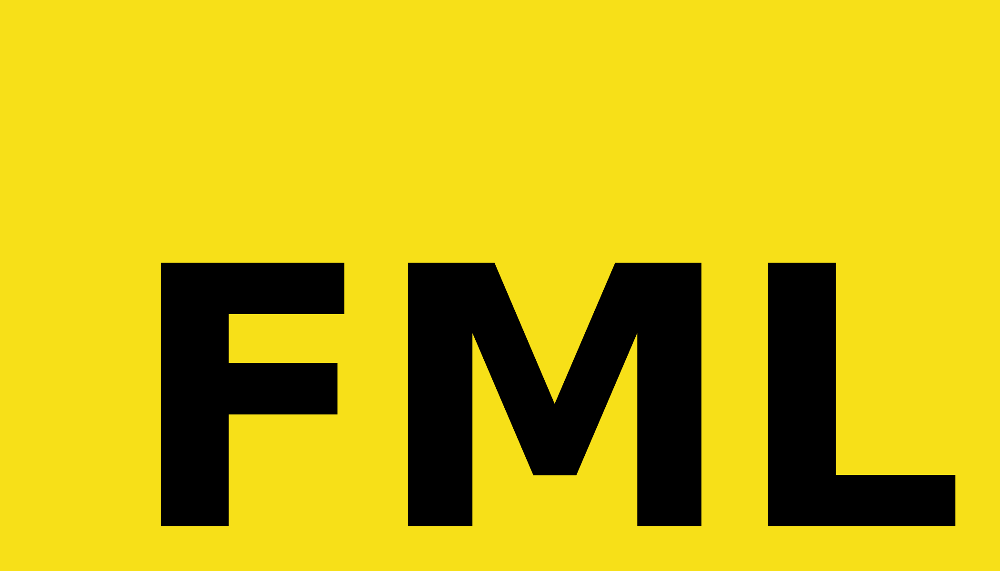

# Fusion Markup Language

> One *markup language* to rule them all, One *markup language* to find them, One *markup language* to bring them all and in the darkness bind them



## What?

Fusion Markup Language combines the most popular markup languages into one language:

```fml
{
  "person": {
    <name>
      <firstName>Rick</firstName>
      <lastName>Astley</lastName>
    </name>
  }
}
```

Fusion Markup Language allows you to embed `json` and `xml` in the same string, this new format is called **FML**.

## How?

Get FML:

```
npm install fusion-markup-language
```

Parse some `fml` in the same way as you would use `JSON.parse()`:

```
const FML = require('fusion-markup-language')

const personObject = FML.parse(`
  <?xml version="1.0" encoding="UTF-8" ?>
  <person>
      {
          "name": {
              "firstName": "Rick",
              "lastName": "Astley"
          }
      }
  </person>
`)

console.log(personObject)
```

## Why?

When it comes to markup languages, developers are spoiled with choice, such as `csv`, `xml`, `json`, `yaml` and `toml`. But why should we pick just one?

Fusion Markup Language attempts to provide an all-in-one solution that can fit any size project.

When you're stuck deciding which markup language, just think FML!
